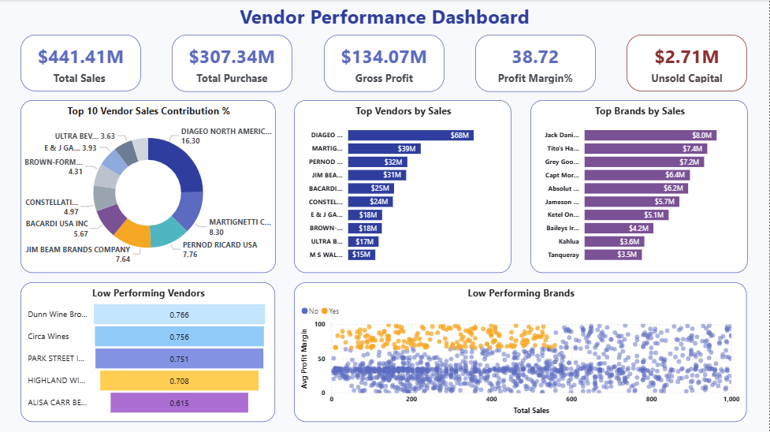

# 🧾 Vendor Performance Analysis

_Analyzing vendor performance and profit contribution to inform data-driven purchasing strategies and inventory optimization decisions using SQL, Python, and Power BI._

---

## 📌 Table of Contents
- <a href="#overview">Overview</a>
- <a href="#business-problem">Business Problem</a>
- <a href="#dataset">Dataset</a>
- <a href="#tools--technologies">Tools & Technologies</a>
- <a href="#project-structure">Project Structure</a>
- <a href="#data-cleaning--preparation">Data Cleaning & Preparation</a>
- <a href="#exploratory-data-analysis-eda">Exploratory Data Analysis (EDA)</a>
- <a href="#research-questions--key-findings">Research Questions & Key Findings</a>
- <a href="#dashboard">Dashboard</a>
- <a href="#final-recommendations">Final Recommendations</a>

---
<h2><a class="anchor" id="overview"></a>Overview</h2>

This project assesses vendor performance and retail inventory behavior to generate actionable insights for purchasing, pricing, and inventory optimization. It implements an end-to-end data pipeline, leveraging SQL for ETL processes, Python for analytical modeling and hypothesis testing, and Power BI for interactive visualization and reporting.

---
<h2><a class="anchor" id="business-problem"></a>Business Problem</h2>

Effective inventory and sales management are essential in the retail sector. This project focuses on:
- Identifying underperforming brands that require pricing or promotional optimization
- Evaluating individual vendor contributions to overall sales and profitability
- Assessing the cost–benefit trade-offs of bulk purchasing strategies
- Detecting inefficiencies in inventory turnover and stock movement
- Statistically validating differences in vendor-level profitability

---
<h2><a class="anchor" id="dataset"></a>Dataset</h2>
- [Dataset Source](https://topmate.io/ayushi_mishra/1557424)
- Multiple CSV files (sales, vendors, inventory) are stored in the /data/ directory. These datasets are ingested and consolidated into a summary table, which serves as the primary input for downstream analysis and reporting.

---

<h2><a class="anchor" id="tools--technologies"></a>Tools & Technologies</h2>

- SQL (Common Table Expressions, Joins, Filtering)
- Python (Pandas, Matplotlib, Seaborn, SciPy)
- Power BI (Interactive Visualizations)
- GitHub

---

<h2><a class="anchor" id="project-structure"></a>Project Structure</h2>

```
vendor-performance-analysis/
│
├── README.md
├── .gitignore
├── Vendor Performance Analysis Report.pdf
│
├── Notebooks/                  # Jupyter notebooks
│   ├── SQL server data upload.ipynb
│   ├── EDA.ipynb
│   ├── Vendor Performance Analysis.ipynb
├── Dashboard/                  # Power BI dashboard file
│   └── Vendor Performance Dashboard.pbix
```
---
<h2><a class="anchor" id="data-cleaning--preparation"></a>Data Cleaning & Preparation</h2>

- Filtered out invalid transactions by excluding records with:
  - Gross Profit ≤ 0
  - Profit Margin ≤ 0
  - Sales Quantity = 0
- Developed vendor-level summary tables to consolidate key performance metrics
- Performed data type standardization, outlier treatment, and lookup table joins to ensure data consistency and analytical accuracy


---
<h2><a class="anchor" id="exploratory-data-analysis-eda"></a>Exploratory Data Analysis (EDA)</h2>

**Data Quality Issues Identified:**
- Gross Profit values as low as -52,002.78, indicating loss-generating transactions
- Profit Margin reaching negative infinity, primarily due to zero or near-zero sales prices
- Presence of unsold inventory, highlighting slow-moving or stagnant stock

**Outliers Detected:**
- Exceptionally high freight costs, reaching up to 257K
- Extreme purchase and actual price values affecting cost structures

**Correlation Insights:**
- Weak relationship between purchase price and overall profitability
- Near-perfect positive correlation between purchase quantity and sales quantity (0.999)
- Moderate negative correlation between profit margin and sales price (-0.179)


---
<h2><a class="anchor" id="research-questions--key-findings"></a>Research Questions & Key Findings</h2>

**Key Analytical Findings:**
1. **Promotion Opportunities:** Identified 198 brands with low sales volumes but high profit margins, making them strong candidates for targeted promotions
2. **Vendor Concentration Risk:** The top 10 vendors account for 65.69% of total purchase volume, indicating a high dependency risk
3. **Bulk Purchasing Benefits:** Large-order purchases deliver approximately 72% per-unit cost savings
4. **Inventory Turnover Gaps:** Approximately $2.71M in inventory remains unsold, signaling inefficiencies in stock movement
5. **Vendor Profitability Comparison:**
   - High-performing vendors: Mean profit margin of 31.17%
   - Low-performing vendors: Mean profit margin of 41.55%
6. **Hypothesis Testing Results:** Profit margin differences between vendor groups are statistically significant, reflecting distinct pricing and operational strategies

---
<h2><a class="anchor" id="dashboard"></a>Dashboard</h2>

- Power BI Dashboard shows:
  - Vendor-wise Sales and Margins
  - Inventory Turnover
  - Bulk Purchase Savings
  - Performance Heatmaps



---

<h2><a class="anchor" id="final-recommendations"></a>Final Recommendations</h2>

- Diversify the vendor portfolio to mitigate dependency and supply risk
- Refine bulk purchasing strategies to balance cost efficiency with inventory flexibility
- Reprice or promote slow-moving, high-margin brands to accelerate sales velocity
- Implement targeted clearance or redistribution strategies to reduce unsold inventory
- Strengthen marketing and distribution efforts for underperforming vendors to improve sales contribution